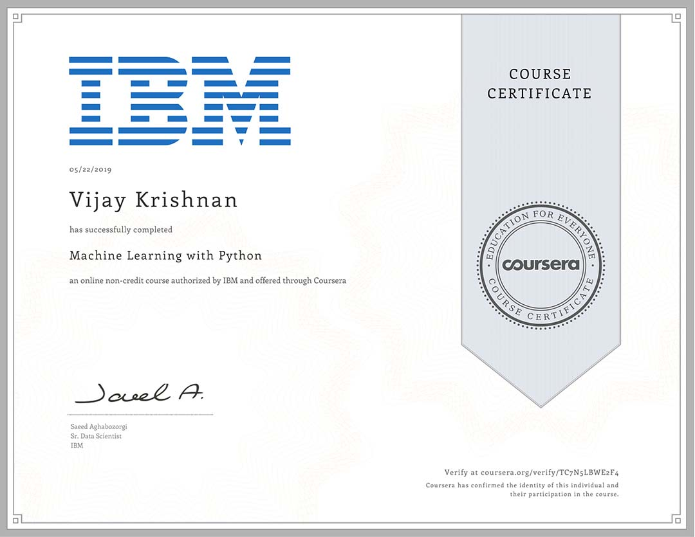

# Machine Learning with Python [IBM and Coursera]
## Successfully completed and earned a badge. :)

* Certificate from Coursera  <b>TC7N5LBWE2F4</b> 
  [See Credential](https://www.coursera.org/account/accomplishments/records/TC7N5LBWE2F4)
  

  
  
* Badge from IBM Watson Studio 
  [See Credential](https://www.youracclaim.com/badges/6100bb60-df9b-4971-992f-a85be27a0e7a/public_url)
  

  
  
